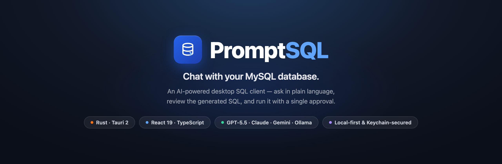
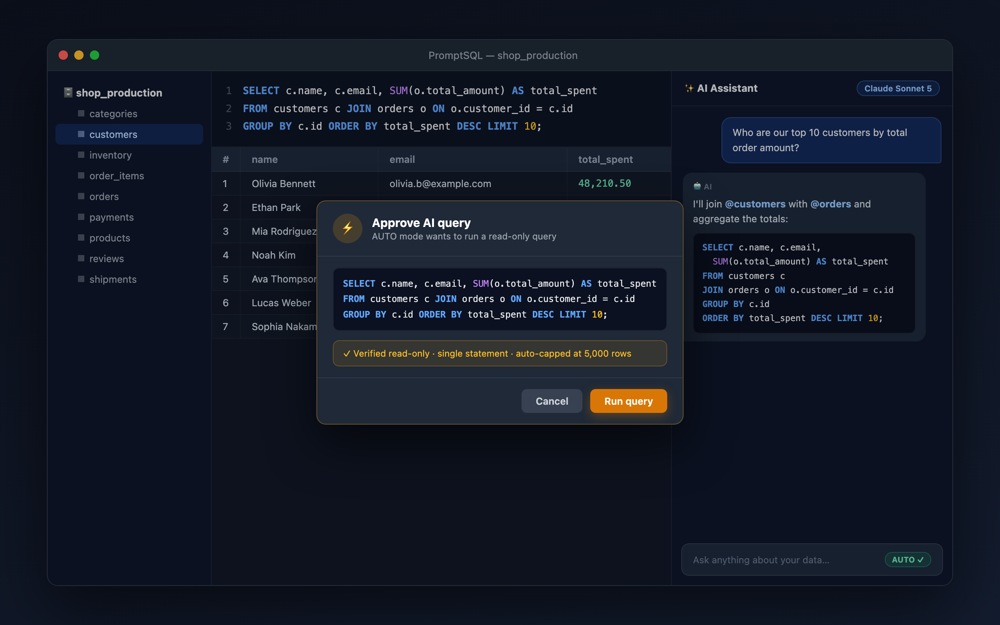
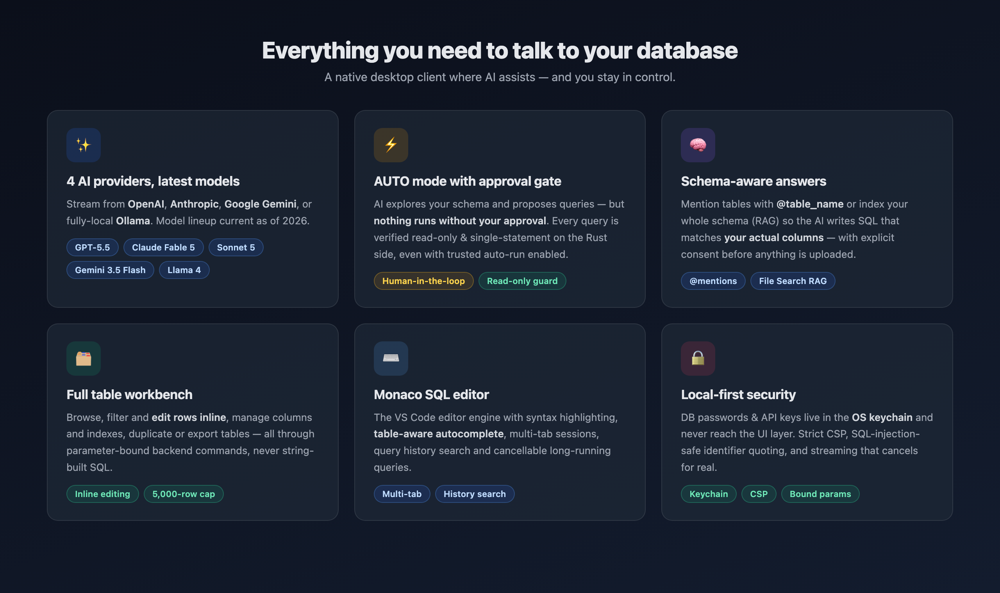

<div align="center">



**Ask your database questions in plain language. Review the SQL. Approve. Done.**

PromptSQL is a native desktop MySQL client where an AI assistant writes and explains
queries for you — while every AI-generated query passes through a human approval gate
and a Rust-side read-only guard before it ever touches your data.

[Features](#features) · [How it works](#how-it-works) · [Security](#security--privacy) · [Getting started](#getting-started) · [Development](#development)

</div>

---

## Why PromptSQL?

Most database GUIs make *you* write the SQL. Most AI SQL tools run whatever the model
produces. PromptSQL sits deliberately in between:

- **You ask in plain language** — "Who are our top 10 customers by total order amount?"
- **AI writes the SQL** using your real schema (via `@table` mentions or full-schema RAG)
- **You stay in control** — AUTO mode shows every query in an approval dialog, and the
  Rust backend independently verifies it is a **read-only, single statement** before
  execution. Even the "trusted auto-run" convenience toggle cannot bypass that check.



## Features



- **AI-powered SQL assistant** — chat to generate, explain, and refine queries with
  real-time streaming responses
- **AUTO mode with approval gate** — AI explores your schema and proposes queries;
  nothing runs without your explicit approval (or an opt-in trusted toggle that still
  enforces the backend read-only guard)
- **Schema-aware answers** — mention tables with `@table_name`, or index your schema
  (RAG) so the AI knows your actual columns; indexing asks for consent before any
  schema data leaves your machine
- **Full table workbench** — browse, filter, and edit rows inline; manage columns and
  indexes; duplicate and export tables
- **Monaco SQL editor** — VS Code's editor engine with syntax highlighting,
  table-aware autocomplete, multi-tab sessions, and searchable query history
- **Cancellable everything** — long-running queries are killed server-side, and AI
  streams stop the moment you hit stop
- **Large-result safety** — result sets are automatically capped at 5,000 rows with a
  clear truncation banner, so a stray `SELECT *` can't freeze the app
- **Dark / light mode** and **4 languages** (English, 한국어, 日本語, 中文)

## Supported AI providers

| Provider | Models (2026-07 lineup) | API key |
|----------|------------------------|---------|
| **OpenAI** | GPT-5.5 · GPT-5.4 · GPT-5.4 Mini | Required |
| **Anthropic** | Claude Fable 5 · Claude Opus 4.8 · Claude Sonnet 5 · Claude Haiku 4.5 | Required |
| **Google Gemini** | Gemini 3.1 Pro · Gemini 3.5 Flash · Gemini 3.1 Flash Lite | Required |
| **Ollama** | Whatever you have installed — detected live via `/api/tags` (Llama 4, Qwen 3, DeepSeek R1, Gemma 3, …) | None (fully local) |

Simple questions are automatically routed to a lighter, cheaper model of the same
provider; complex ones use the model you picked.

## How it works

1. **Connect** to MySQL — saved connections keep the password in the OS keychain, and
   it is never sent back to the UI
2. **Ask** the AI panel anything about your data, mentioning tables with `@`
3. **Approve** the generated query in the confirmation dialog (AUTO mode), or copy it
   into the editor and run it yourself
4. **Work with results** — sort, edit inline, export, or keep the conversation going

## Security & privacy

Security is the core design constraint, not an afterthought:

- **Credentials never touch the frontend** — DB passwords and AI API keys are stored in
  the native keychain (macOS Keychain / Windows Credential Manager / Linux Secret
  Service) and are read only by the Rust backend
- **Approval gate + read-only guard** — every AUTO-mode query requires user approval;
  independently, the backend rejects anything that is not a single read-only statement
  (comment-stripping, string-aware multi-statement detection)
- **No string-built SQL** — table browsing and editing go through parameter-bound
  backend commands with strict identifier quoting
- **Strict Content-Security-Policy** in the production bundle
- **Explicit RAG consent** — schema indexing (Google Gemini File Search) never happens
  without an informed opt-in dialog
- **Local-first** — everything else stays on your machine; conversations are stored
  locally

## Getting started

### Download

Grab the latest `.dmg` (macOS) from [Releases](https://github.com/soulduse/PromptSQL/releases),
or build from source below.

### AI provider setup

1. Open **Settings** (gear icon)
2. Pick a provider and paste your API key — it is verified live and stored in the keychain
3. Choose a model

For **Ollama** no key is needed — just have the Ollama server running locally and your
installed models appear automatically.

## Development

### Prerequisites

- [Node.js](https://nodejs.org/) v18+
- [Rust](https://www.rust-lang.org/tools/install) 1.77.2+
- [Tauri prerequisites](https://v2.tauri.app/start/prerequisites/)

### Run & build

```bash
git clone https://github.com/soulduse/PromptSQL.git
cd PromptSQL
npm install

npm run tauri dev     # development
npm run tauri build   # release bundle → src-tauri/target/release/bundle/
```

### Quality gates

```bash
npm run typecheck               # TypeScript
npm run lint                    # ESLint
npm run check:i18n              # locale key parity (en/ko/ja/zh)
cd src-tauri && cargo test      # Rust unit tests (SQL guard, streaming, model registry)
```

## Tech stack

| Layer | Technology |
|-------|------------|
| Frontend | React 19, TypeScript, Tailwind CSS (token-based theming), Zustand |
| Editor | Monaco Editor |
| Backend | Rust, Tauri 2.x |
| Database | MySQL via `mysql_async` (bound parameters, pooled per-database) |
| AI | Multi-provider SSE/NDJSON streaming with UTF-8-safe framing & real cancellation |

## Contributing

Contributions are welcome! Please feel free to submit a Pull Request.

## License

This project is licensed under the MIT License — see the [LICENSE](LICENSE) file for details.
